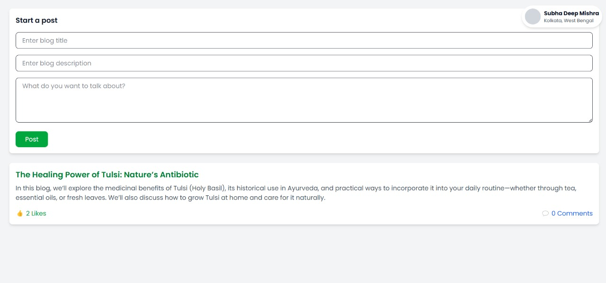

# 🌿✨ FloraMed — Frontend 🌱💻

Welcome to the **frontend repository** for the **Virtual Herbal Garden** — an immersive herbal exploration platform where users can discover, learn about, and interact with various herbs from around the world! 🌎🍃

---

## 🚀 Tech Stack

- ⚛️ **React**
- ⚡ **Vite**
- 🎨 **Tailwind CSS**
- 📦 **Axios**
- 🌐 **Sketchfab API** for 3D Herb Models
- 🎙️ **Web Speech API** (Voice Command Features)

---

## ✨ Features

✅ Interactive 3D herb model viewer using **Sketchfab**  
✅ Voice-controlled actions via **Web Speech API** (like adding to cart) 🎙️🛒   
✅ Bookmarking Herbs
✅ Blogging Page
✅ Dashboard Access
✅ Health News
✅ Gardening Tips
✅ Health and Wellness Section
✅ Responsive and clean UI using **Tailwind CSS**

---

## 📸 Some Screenshots

| 🌿 Home Page | 🛒 3D Model | 📖 Blog |
|:------------|:---------|:----------|
|  |  |  |

---
